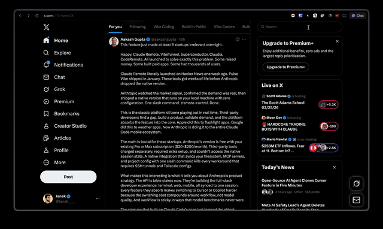

# X Focus Mode

A lightweight Manifest V3 Chrome extension for a calmer reading experience on X (formerly Twitter). It hides visual distractions, improves article readability, and lets you save readable X Articles locally as Markdown or PDF.



## Current status

The extension is a functional local MVP and is not currently published to the Chrome Web Store. The focus controls and X Article export flows are implemented, but X’s DOM and article markup can change without notice, so selectors and export behavior may require maintenance.

There is no automated test suite in the repository yet. Manual validation in Chrome is recommended after loading the extension.

## Features

### Focus controls

- **Hide Sidebars**: Removes X’s left navigation and right sidebar, then centers the primary column.
- **Wide Layout**: Expands the primary column up to 900px.
- **Zen Typography**: Increases text size and line height, improves wrapping, and adds article spacing.
- **Independent toggles**: Configure each reading preference from the extension popup; settings persist through Chrome storage.

### Article export

- **Article extraction**: Reads supported X Article views directly from the active tab without an API key.
- **Markdown export**: Preserves titles, metadata, links, emphasis, headings, blockquotes, lists, code blocks, and article media markers.
- **PDF export**: Creates a self-contained PDF in the browser with formatted text and available article images.
- **Media support**: Collects article images and video posters; media is capped and oversized or unavailable assets are skipped gracefully.
- **Save As workflow**: Uses Chrome’s native save dialog and suggests a filename based on the article title.

## Installation (Developer Mode)

This extension is not currently published to the Chrome Web Store. To install it locally:

1. Clone or download this repository to your local machine:
   ```bash
   git clone https://github.com/janak21/X-Focus-Mode.git
   ```
2. Open Google Chrome and navigate to `chrome://extensions/`.
3. Toggle on **"Developer mode"** in the top right corner.
4. Click the **"Load unpacked"** button in the top left corner.
5. Select the folder containing this repository's files.
6. The extension will appear in your Chrome toolbar. Click the puzzle icon and pin it for easy access!

## Usage

1. Navigate to [x.com](https://x.com).
2. Click the **X Focus Mode** icon in your Chrome toolbar.
3. Use the toggle switches in the popup to customize your reading experience:
   * **Hide Sidebars**: Removes the left and right clutter.
   * **Wide Layout**: Expands the reading area to 900px wide.
   * **Zen Typography**: Switches to a larger, softer font for easier reading.
4. When viewing a supported X Article, use **Markdown** or **PDF** under **Download article** and choose a save location.

If export cannot find an article, refresh the X page and try again. Export currently depends on the article being rendered in a supported X Article view.

## Tech Stack

- **Manifest V3**: Modern Chrome extension architecture.
- **Vanilla JavaScript and CSS**: No runtime dependencies.
- **Chrome APIs**: `storage` for preferences, `activeTab` for the current X tab, and `downloads` for Save As exports.
- **Client-side generation**: Markdown and PDF files are built in the browser.

## Privacy & security

The extension has no backend, analytics, or authentication. Article text and export files are processed locally in the browser, and no content is sent to an extension-owned server. PDF image embedding may fetch the article’s existing X/Twitter media URLs from `twimg.com`; those requests are subject to X and browser behavior.

The extension only runs on X/Twitter pages matched by the manifest and does not require an API key.

## Creating Extension Icons
If you wish to modify the icons, ensure you replace the following files in the root directory with your own PNG assets, keeping the dimensions exact:
* `icon16.png` (16x16)
* `icon48.png` (48x48)
* `icon128.png` (128x128)

## Contributing

Pull requests are welcome. Useful areas for contribution include improving compatibility with X’s changing article markup, adding automated extraction tests, and refining export formatting.

## License
MIT License - use this freely to improve your focus flow!
